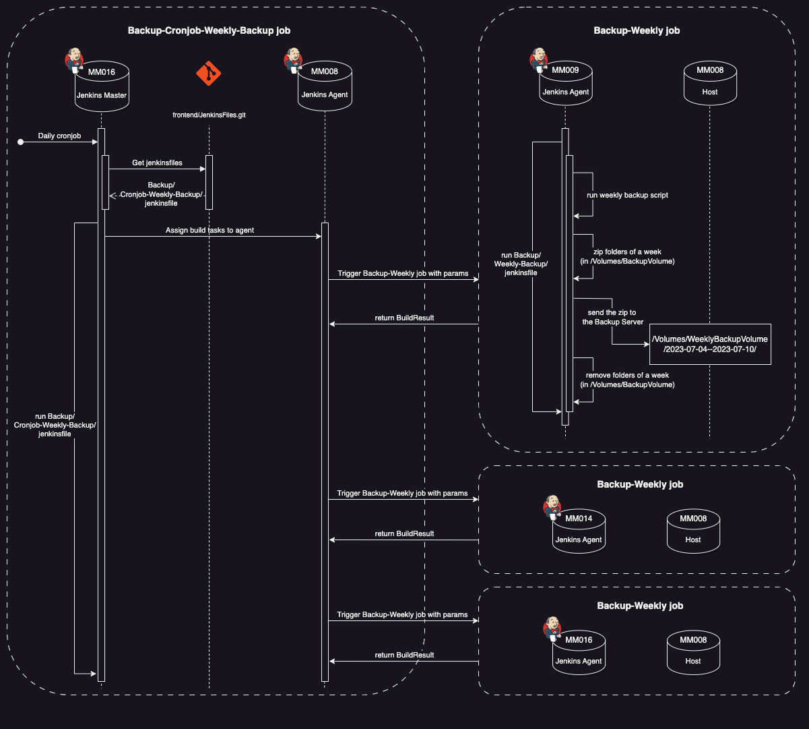
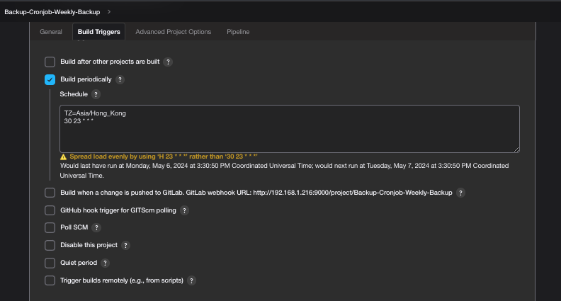
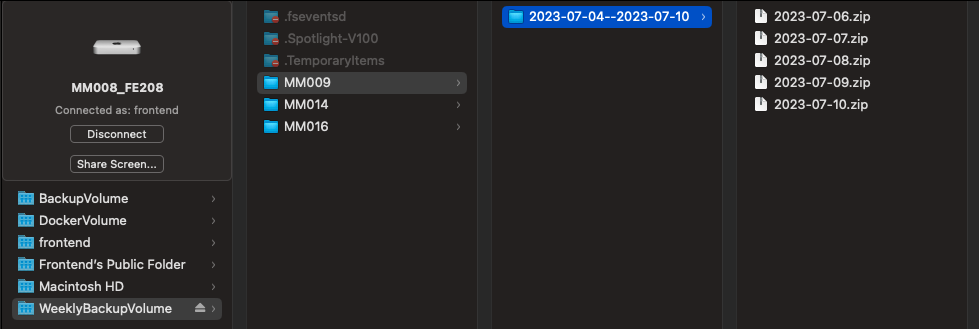

# Weekly backup

This is an integrated application that is developed with node.js and Jenkins that provide weekly backup services of each agent.

The system is mainly divided into two parts.

One is the node.js part that scan the backup volume and zip 7 days folder as 2010-01-01--2010-01-07.

Another one is the Jenkins part that run the nodejs in server agent and send the result to **WeeklyBackupVolume** in MM008.

It can be called by other cronjobs to zip 7 days folder in different agent.

## Background:

- a job with parameters called **Backup-Weekly**
    - **backup_agent***: choosing which agent u want to backup
    - * : Required parameters
- called by a cronjob: **Backup-Cronjob-Weekly-Backup**
- take place in **backup_agent (**pass from param**)**
- run nodejs from **Weekly_backup.git**

---

## Aims:

- zip 7 days folder in backupVolume
- send the zip to MM008 for storage

---

## Usage: Weekly backup and send to MM008 server

### Backup-Cronjob-Weekly-Backup

- cronjob for running **Backup-Weekly**
- as a task manager to assign different agent to run Backup-Weekly job



```jsx
sh ('node index.js -- -- BACKUP_VOLUME_PATH $BACKUP_VOLUME_PATH -- CURDATE $CURDATE_DIR')
```

- trigger every night



- check isSunday and only run weekly backup when it is sunday

```groovy
ZoneId timeZone = ZoneId.of("Asia/Hong_Kong")
LocalDate currentDate = LocalDate.now(timeZone)
int dayOfWeekNumber = currentDate.getDayOfWeek().getValue()
println("Day of the week number: ${dayOfWeekNumber}")

if (dayOfWeekNumber == 7) {
    env.isSunday = true
} else {
    env.isSunday = false
}
```

---

## Result

### Location of zip of 7 days folder in WeeklyBackupVolume

- save in the /Volumes/WeeklyBackupVolume in **MM008**
- the range of date will be the folder name



---